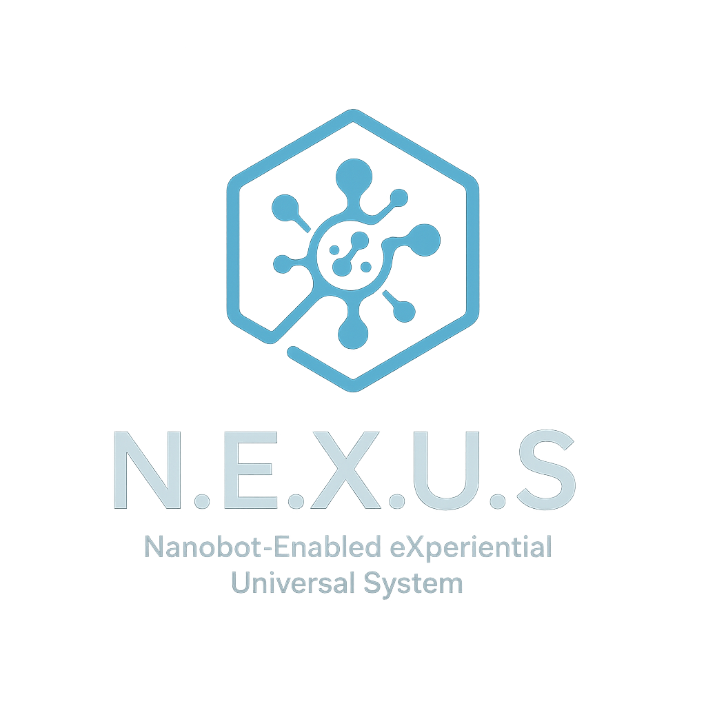

# NEXUS
"N.E.X.U.S. – Nanobot-Enabled eXperiential Universal System: AI-integrated ethical health augmentation framework"
 # N.E.X.U.S. (Nanobot-Enabled eXperience and Understanding System)



## Overview
N.E.X.U.S. is an interactive platform for simulating nanobot swarms, neural overlays, and human-machine interfaces.

## Features
- 3D human body mesh with neural overlays
- Swarm mission visualization and mapping
- Live NanoCodeLab programming console (with authentication)
- Advanced visual effects: volumetric lights, particle trails, data streaming
- Modular, extensible architecture

## Quick Start
1. **Install dependencies:**
	```sh
	npm install
	# or
	yarn install
	```
2. **Add a 3D body mesh:**
	- Download a CC0-licensed human mesh (see `/docs/models/README.md`)
	- Place as `body.glb` in `/docs/models/`
3. **Run the app:**
	```sh
	npm start
	# or
	yarn start
	```
4. **Login to NanoCodeLab:**
	- Use the login form (default: admin/admin)

## Screenshots
<!-- Add screenshots here -->

## File Structure
```
/docs/models/         # 3D models (body.glb)
/neuro_swarm_mapping.json  # Brain-to-swarm mapping config
NanoCodeLab.tsx      # Live programming console
SwarmMap3D.tsx       # 3D visualization
Dashboard.tsx        # Main dashboard UI
```

## Contributing
Pull requests welcome! Please open issues for suggestions or bugs.

## License
[MIT](./LICENSE)
